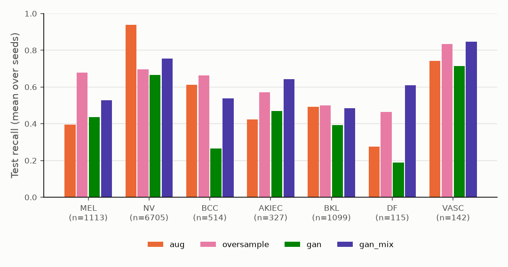
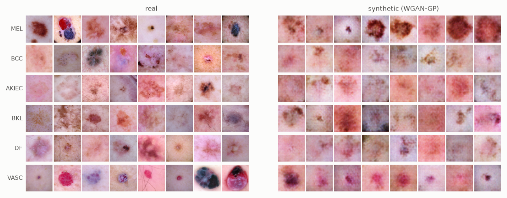

# LesionBench

[](https://github.com/VivekReddy2001/lesionbench/actions/workflows/ci.yml)


**Does synthetic data actually help an imbalanced skin-lesion classifier, or
does it only look that way?**

HAM10000 is the standard benchmark for dermoscopic image classification:
10,015 images, 7 diagnoses, and a 58:1 imbalance between the largest class
(melanocytic nevi, 67% of images) and the smallest (dermatofibroma). GAN-based
augmentation is a popular fix, including in our own
[SkinAid paper (IEEE OCIT 2021)](https://github.com/VivekReddy2001/SkinLesions_GenerativeAI).
This repository re-asks that question with the controls a skeptical reviewer
would want:

- **Lesion-level splits.** HAM10000 has 10,015 images of only 7,470
  lesions, because many lesions were photographed more than once. With the
  usual image-level random split, **34% of test images have a sibling
  photograph of the same lesion in the training set**. Every headline number
  here uses splits where no lesion appears on both sides. The leaky protocol
  is also run, to measure how much it inflates results.
- **Same compute for every method.** Every method gets the same network,
  optimiser, schedule and number of gradient steps. Methods that enlarge the
  training set (oversampling, GAN top-up) do not get extra epochs.
- **A generator that never sees the test set.** The GAN is retrained for
  every seed on that seed's training split only.
- **Metrics that resist imbalance.** Balanced accuracy and macro-F1 lead,
  plus per-class recall, macro AUROC and expected calibration error.
  Plain accuracy is reported but not used to rank methods: predicting "nevus"
  for everything already scores 67%.
- **A memorisation check.** Are synthetic images new, or near-copies of
  training images?

<!-- RESULTS:START -->
## Results

3 seeds × 8 methods on the lesion-level split, plus the leaky image-level
split for two methods (30 training runs, all on a 4-core CPU). Test set,
mean ± std over seeds. Full tables: [`results/RESULTS.md`](results/RESULTS.md).
Every run's metrics, training curve and test probabilities are in
[`results/runs/`](results/runs).

| Method | Bal. acc | Macro-F1 | Accuracy | Macro AUROC | ECE ↓ |
|---|---:|---:|---:|---:|---:|
| Baseline (no augmentation) | 0.436 ± 0.022 | 0.436 ± 0.017 | 0.702 ± 0.013 | 0.868 ± 0.016 | 0.208 ± 0.006 |
| Classic augmentation | 0.554 ± 0.013 | **0.578 ± 0.015** | **0.785 ± 0.013** | **0.939 ± 0.004** | **0.034 ± 0.010** |
| + class-weighted loss | **0.629 ± 0.017** | 0.510 ± 0.007 | 0.656 ± 0.002 | 0.921 ± 0.006 | 0.064 ± 0.011 |
| + focal loss | 0.547 ± 0.021 | 0.572 ± 0.014 | 0.780 ± 0.006 | 0.936 ± 0.004 | 0.097 ± 0.005 |
| + class-balanced oversampling | **0.629 ± 0.023** | 0.528 ± 0.008 | 0.666 ± 0.029 | 0.923 ± 0.001 | 0.099 ± 0.026 |
| + GAN top-up (real + synthetic) | 0.447 ± 0.030 | 0.358 ± 0.069 | 0.578 ± 0.150 | 0.860 ± 0.043 | 0.112 ± 0.087 |
| + GAN mix (50% synthetic per minority class) | **0.629 ± 0.032** | 0.521 ± 0.041 | 0.685 ± 0.043 | 0.919 ± 0.013 | 0.066 ± 0.020 |
| Synthetic only (train on GAN, test on real) | 0.455 ± 0.013 | 0.371 ± 0.026 | 0.627 ± 0.051 | 0.855 ± 0.012 | 0.206 ± 0.053 |

*Chance-level balanced accuracy is 0.143. Always predicting "nevus" scores 0.67 accuracy.*



### What the numbers say

1. **Synthetic data did not beat plain oversampling.** `gan_mix` and
   `oversample` both reach 0.629 balanced accuracy. `gan_mix` has the
   larger variance across seeds, and its gains on the rarest classes
   (dermatofibroma recall 0.61 vs 0.46, actinic keratosis 0.64 vs 0.57) are
   paid for on melanoma (0.53 vs 0.68). With three seeds, none of these
   per-class differences is conclusive.
2. **Letting synthetic images dominate hurts.** Topping every class up to
   the majority size makes 83–98% of each minority class synthetic.
   Balanced accuracy falls to 0.447, no better than training without any
   augmentation. The classifier learns the generator's artefacts.
3. **The synthetic images do carry real signal.** A model trained *only* on
   GAN output reaches 0.455 balanced accuracy on real test images, about 3×
   chance, so the generator captures class-relevant structure. It still
   falls well short of 0.554 for real data with augmentation.
4. **The GAN is not copying its training set.** For every class, synthetic
   images sit as far from their nearest training image as held-out real
   test images do. Fewer than 3% are closer than the 5th percentile of real
   test images (table in `RESULTS.md`).
5. **Cheap augmentation is the biggest single win:** +0.118 balanced
   accuracy, and calibration error drops six-fold (0.208 → 0.034).
6. **Rebalancing trades accuracy and calibration for minority recall.**
   Class weights and oversampling lift balanced accuracy by 0.075, and
   melanoma recall from 0.40 to 0.67–0.68. Nevus recall falls from 0.94 to
   0.70, and ECE rises to 0.064–0.099. Which side of that trade is right is
   a clinical decision, not a modelling one.

### The split protocol matters more than most method choices

| Method | Split | Test images with a sibling photo in train | Bal. acc | Macro-F1 |
|---|---|---:|---:|---:|
| Classic augmentation | image-level | 35.2% | 0.603 ± 0.010 | 0.627 ± 0.002 |
| Classic augmentation | **lesion-level** | 0.0% | 0.554 ± 0.013 | 0.578 ± 0.015 |
| + oversampling | image-level | 35.2% | 0.712 ± 0.020 | 0.623 ± 0.015 |
| + oversampling | **lesion-level** | 0.0% | 0.629 ± 0.023 | 0.528 ± 0.008 |

The common image-level split inflates balanced accuracy by **+0.05 to
+0.08**, about the same as the gap between the best and worst sensible
methods above. Over a third of its test images are near-duplicates of
training images. Results reported on HAM10000 without a lesion-level split,
including our own 2021 paper, should be read with this in mind.

### Samples



*Left: real training images. Right: class-conditional WGAN-GP samples (seed 0), 64×64.*

<!-- RESULTS:END -->

---

## Methods compared

All methods train the same ~1.2M-parameter ResNet-style CNN at 64×64 for
2,000 steps of batch 128 (AdamW, one-cycle LR). The checkpoint with the best
**validation** balanced accuracy is evaluated once on the test split.

| Method | What changes |
|---|---|
| `erm` | Nothing: plain cross-entropy, no augmentation |
| `aug` | Flips, 90° rotations, ±4 px shifts, ±15% brightness/contrast |
| `weighted` | `aug` + cross-entropy weighted by inverse class frequency |
| `focal` | `aug` + focal loss (γ = 2) |
| `oversample` | `aug` + class-balanced sampling (minority images repeat) |
| `gan` | `aug` + each minority class topped up with **synthetic** images to the size of the largest class |
| `gan_mix` | `aug` + class-balanced sampling, where each minority class draws half its samples from real and half from synthetic images |
| `synthetic_only` | Trained only on a balanced synthetic set (1,000 GAN images for each of the 7 classes), tested on real images: a direct measure of synthetic-data quality |

`oversample` and `gan` are the key pair. Both present a balanced training
stream; the only difference is whether minority examples are *repeated real
images* or *new synthetic ones*. If synthesis adds information, `gan` should
win.

### The generator

A class-conditional **WGAN-GP** (Gulrajani et al., 2017) at 64×64:

- DCGAN-style generator with a learned class embedding concatenated to the
  noise;
- projection critic (Miyato & Koyama, 2018) with layer norm instead of
  batch norm, since the gradient penalty is defined per sample;
- 5 critic steps per generator step, λ = 10, Adam (β = 0, 0.9), lr 1e-4,
  3,000 generator iterations;
- square-root class-balanced sampling, so rare classes are seen more often
  than their frequency but not so often that the critic memorises them;
- only the symmetries dermoscopy genuinely has (rotations, flips) are used
  as augmentation, so no artefacts leak into the generated distribution.

The paper version trained one unconditional generator per class. A single
conditional model shares capacity across classes, which matters when the
smallest class has about 80 training images.

---

## Reproducing

```bash
pip install -e ".[dev]"

# 1. download ISIC 2018 Task 3 (= HAM10000, 2.7 GB) and build a 64x64 .npz (~100 MB)
python -m lesionbench prepare

# 2. everything: 3 seeds x (GAN + 8 methods) + image-level split runs (~6 h on a 4-core CPU)
bash scripts/run_all.sh

# or a single configuration
python -m lesionbench gan --seed 0
python -m lesionbench classify --method gan --split lesion --seed 0

# 3. tables and figures -> results/RESULTS.md, results/figures/
python -m lesionbench report
```

No GPU is needed. Every run writes its configuration, validation and test
metrics, training curve and test-set probabilities to `results/runs/`. The
`report` step rebuilds every table from those files.

The data comes from the official ISIC 2018 Challenge release, including the
`LesionGroupings.csv` file that maps each image to its lesion:
`https://isic-challenge-data.s3.amazonaws.com/2018/`.

## Project layout

```text
lesionbench/
  data.py      download layout, 64x64 preprocessing, lesion- and image-level splits
  models.py    SmallResNet classifier; conditional WGAN-GP generator + projection critic
  gan.py       GAN training on the training split, sampling, memorisation check
  train.py     the eight methods, fixed-step training, checkpoint selection
  metrics.py   balanced accuracy, macro-F1, per-class recall, AUROC, ECE
  report.py    tables and figures from results/runs/*.json
  cli.py       prepare / gan / classify / report
scripts/run_all.sh   the full, resumable benchmark
tests/               fast tests on synthetic data (no download needed)
```

## Limitations

- **64×64 resolution and a small CNN**, so that the whole benchmark runs on a
  CPU. Absolute numbers are well below ImageNet-pretrained models at full
  resolution. The comparison between methods under identical conditions is
  the point, not the absolute ceiling.
- **One generator family.** Diffusion models are a natural next comparison.
- **Pixel-space memorisation check.** Feature-space distances (e.g.
  Inception features) would be more sensitive. Pretrained weights were
  deliberately avoided to keep the pipeline self-contained.

## Related

- Medi, Nemani, **Pitta**, Udutalapally, Das, Mohanty. *SkinAid: A GAN-based
  Automatic Skin Lesion Monitoring Method for IoMT Frameworks.* IEEE OCIT 2021.
  [DOI 10.1109/OCIT53463.2021.00048](https://doi.org/10.1109/OCIT53463.2021.00048) ·
  [code](https://github.com/VivekReddy2001/SkinLesions_GenerativeAI)
- Tschandl, Rosendahl, Kittler. *The HAM10000 dataset.* Scientific Data 5, 2018.

## License

MIT, see [LICENSE](LICENSE). The HAM10000 images are distributed by ISIC under
CC BY-NC 4.0 and are **not** included in this repository.
